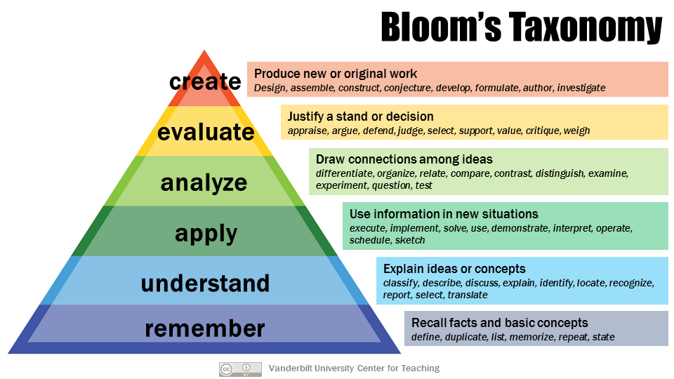

% Data Workshop
% Rasmus Erik @solsort.com
% September 2018

# Welcome and intro to Jupyter
## Introduction

<small>English or Danish?</small>

- Purpose and background
- Plan / topics
- Structure
- Introduction to Jupyter Notebooks

## About

- Purpose: your learning   <small>Applicable tools and useful knowledge in studies, research, and professionally</small>
- <small>My background: Own company, consultant, and software development. Computer Scientist from KU, including library and information science and teaching.  I am here, because I want to pass on my experience</small>
- Your Background:  Semester? IT-experience? Interests/passions? Projects?

## Topics / plan

- Welcome and introduction to Jupyter
- Fetching and working with data
- Wordcloud visualisation (and learning)
- Computer language - (and tactics vs strategy)
- Structured data (JSON)
- WWW / Internet - HTTP
- Data Science - literature case study*
- Digital images*
- Your topic!*
- Conclusion

## Structure

Exploring a series of topics.

- Theory / lecture / perspective
- Examples - follow along
- Exercises, free experimentation, including break
- Follow-up 

Do interrupt and ask questions!  

## What is Jupyter Notebook

- Tool for working with data
- Primary tool within science
- Web application, cloud + local

## Examples

- Opening Jupyter Notebooks
- Jupyter tour: modes, cells, text and code, builtin help, errors, kernel
- Calculation with data

## Exercises

- User interface tour
- Exercises from Introduction to Jupyter (in Danish, from data-science-workshop.com)

## Follow up on exercises

# Fetching and calculating with data
## Computer language

Analogy - a different country: 
Pointing and gestures vs language

GUI vs CLI

Examples of computer languages

## Examples

<small>Information overload...</small>

- calculating with data
- debugging
- importing and using functionality: request, frequency, random
- random word
- random jargon entry
- word frequencies
- naming

## Exercises

- fetch urls, and print content
- generate random sentences, - like random words, but with subject-verb-object words
- random fortune-quote
- word frequencies from online book of choice

## Follow up on exercises

# Learning, and Visualisation: Wordclouds
## Blooms taxonomy

## Examples

- wordcloud
    - with own words
    - with popular words from book
    - with stop-words

## Exercises

- Wordcloud 
    - with own words
    - with popular words from data source of choice

## Follow up on exercises

# Computer language
## What is data

- Computer = calculator
- All is numbers
- Recipies

## Tactics and Strategy

- Overview vs detail
- Pair programming
- Tip for working together

## Examples

- definitions
- for loops
    - all word combinations
- list comprehension
- refactoring code

## Exercises

- repeated random sentences / words
- refactor code from previous exercises

## Follow up on exercises

# Types of data
## JSON

- strings
- numbers
- true / false (*Boolean* values)
- lists
- dictionaries

## Data structures

Nested lists and dictionaries

- bibliography example
- person / social media example

## Examples

- Fetching and accessing JSON-data: 
    - wikipedia
    - reddit

## Exercises

- Wordcloud of linked articles from wikipedia
- Wordcloud from popular words on reddit

## Follow up on exercises

# About the Web / Internet
## Web and HTTP

- How the internet works (whiteboard)
- Look at brows http-requests
- Web data

## Examples

- YouTube OGP
- RSS-DR
- Creative Commons photots

## Exercises

- List headlines
- Show pictures from search

## Follow up on exercises

# Data Science
## The Scientific method

- Question
- Hypothesis
- Prediction
- Testing
- Analysis

## Data Science

- Whiteboard examples
    - Clustering
    - Models - linear regression
- Supervised vs unsupervised

## Examples

- Topic-space
- Recommender
- Clustering
- Meta-data analysis

## Exercises

- implement the examples yourself
- explain / discuss the examples to your neighbour

## Follow up on exercises

# Images
## What are images

- Images as numbers
- What is color

## Examples

- Fetching image
- Scale image
- Composition

## Exercises

- Random collage
- Find images via API and compose

## Follow up on exercises

- Image color analysis

# Your topic

## Live coding example and exercise
# Conclusion
## Discussion

- Neighbours: what is the primary thing you remember / have learned?
- Brainstorm of cases for next time?

## Futher studies

- [Thinking in Python](http://greenteapress.com/wp/think-python-2e/)
- [Code Combat](https://codecombat.com/play)
- [Data Camp](https://www.datacamp.com/courses/intro-to-python-for-data-science)
- [Code Academy](https://www.codecademy.com/learn/learn-python)

NB: Python 3 vs 2.
